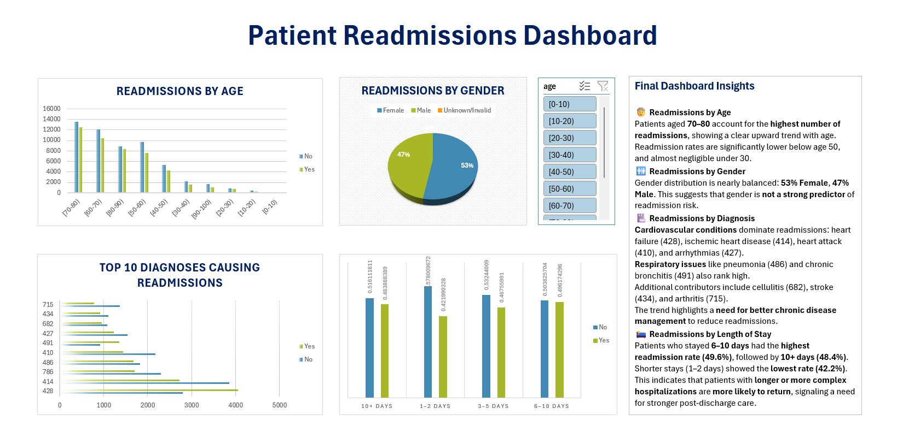

# Patient Readmissions Analysis – Excel Dashboard

This project analyzes hospital patient readmissions using an Excel-based dashboard. The goal is to identify patterns that can help healthcare teams reduce avoidable readmissions.

---

## 📊 Project Summary

- **Domain:** Healthcare (Clinical)
- **Tool Used:** Microsoft Excel
- **Dataset Type:** Aggregated hospital discharge data
- **Focus Areas:** Age, gender, diagnosis, and length of stay trends in readmissions

---

## 🔍 Final Dashboard Insights Summary

### 🧓 Readmissions by Age
- Patients aged **70–80** had the highest number of readmissions.
- Older patients (60+) show a clear increase in readmission likelihood.
- Readmission rates drop significantly below age 50, and are nearly negligible under 30.

### 🚻 Readmissions by Gender
- Gender distribution is almost equal: **53% Female**, **47% Male**.
- This suggests that gender is **not a strong predictor** of readmission risk.
- Entries marked as "Unknown/Invalid" are minimal and do not affect conclusions.

### 🏥 Readmissions by Diagnosis
- **Cardiovascular conditions** are the most common:
  - Heart failure (428), ischemic heart disease (414), heart attack (410), arrhythmias (427)
- **Respiratory illnesses** are also notable:
  - Pneumonia (486), chronic bronchitis (491)
- Other frequent contributors:
  - Cellulitis (682), stroke (434), arthritis (715)
- Emphasizes the need for better chronic disease management to reduce readmissions.

### 🛏️ Readmissions by Length of Stay
- Highest readmission rates are seen in:
  - **6–10 days stay**: 49.6%
  - **10+ days stay**: 48.4%
- Lowest rate for **1–2 day stays**: 42.2%
- Longer or more complex hospitalizations are linked to higher return rates, suggesting the need for stronger post-discharge planning.

---

## 📁 Files Included

- `Patient_Readmissions_Dashboard.xlsx` – The Excel dashboard
- `Assets/dashboard_preview.png` – Dashboard screenshot

---

## 📸 Dashboard Preview

---

## 🧭 Future Scope

- Connect to a real-time database using Power Query or SQL
- Add risk scoring or prediction layer using Python/Power BI
- Build a web-based dashboard version using Power BI or Tableau

---

## 👩‍💻 Author

**Varshita Yeddula**  
*Data/BI Analyst (Health-Tech Focus)*  
📧 [Email](varshitayeddula@gmail.com)  
🔗 [LinkedIn](https://www.linkedin.com/in/varshita-reddy-yeddula-45102b254)
